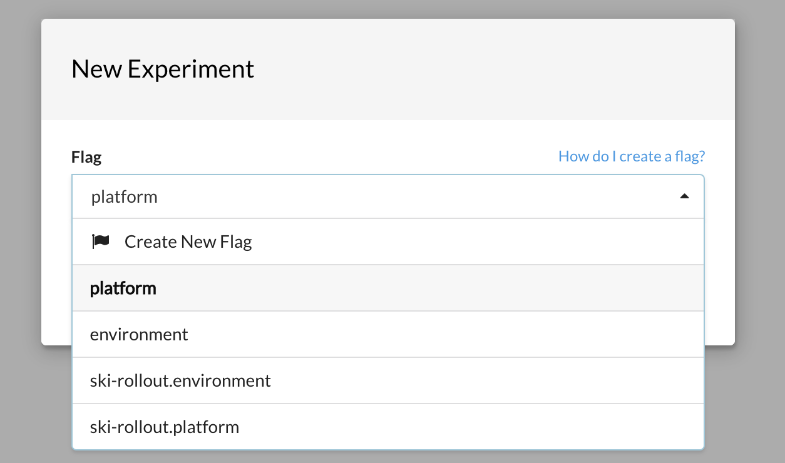
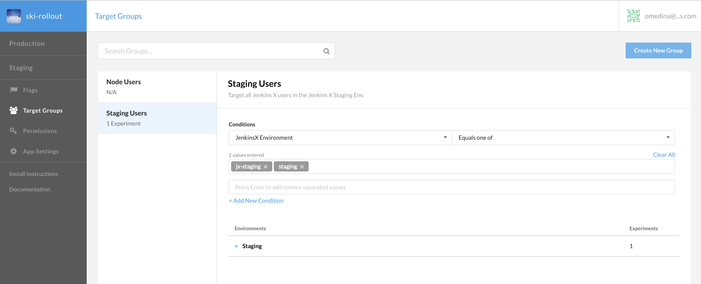
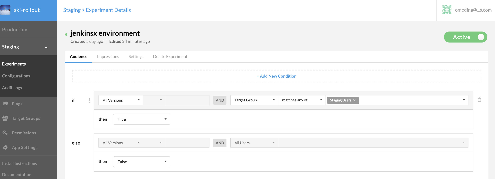

# Overview 

This QuickStart shows how you might use Rollout.io to provide feature flags to your application. 

# Use Case
The use case we cover here is as follows:  The application is deployed using Jenkins X, we have Staging and Production environments.  We want to target the Staging Environment Users and display a button, only for Staging environment.  The concept covers targeting a Group in Rollout, and also showing features in a given Jenkins X environment.

# Gettting Started

To get started, you will need to do the following:

1. Sign up for a rollout.io account.
2. Ensure you have to Rollout Environments (Production, Staging) 
3. Create a Custom Property, call it `JenkinsX Environment` of type `string` by going to left navigation **App Settings** > **Custom Properties**, click _Add New Custom Property_
4. Create a **Flag** within the Rollout `Staging` environment, by clicking on the left nav under Staging > Experiements, then click **New Experiement** and select `Create Flag1`  Confusing right, but that should work.

Call the flag `jenkinsx environment`, this will map to an internal name of `ski-rollout.jenkinsx_environment` which we create via code.

5. Create a **Target Group** and configure it as shown below

We are creating a **Target Group** that is _targeting_ the Staging Environment in Jenkins X.  

**NOTE:** Enter the values as strings (multiple), ensure that you add the exact name of your environment `namespace`, which you can obtain by executing `jx get env` and view the **NAMESPACE** column.

6. Create an **Experiment** and configure it to target the group you created in the previous step.  It should be configured as follows:

Ensure, that the dropdown, is set to `true`.